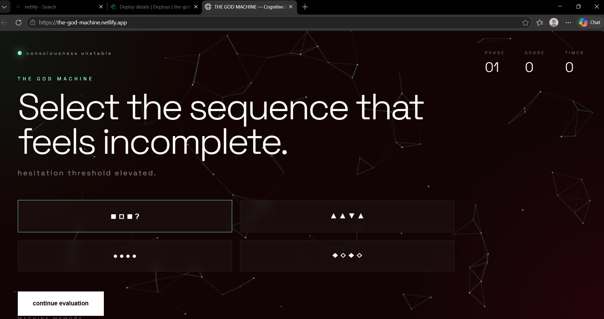

# README UPDATE TEST ✔ WORKING
<!-- HEADER BANNER -->

  

<h1 align="center">⚡ THE GOD MACHINE</h1>

  <b>Interactive Cognitive Evaluation System | Experimental UI | Neural Quiz Engine</b>

---

## 🌐 Live Demo
👉 https://the-god-machine.netlify.app

---

## 📸 Preview

  

---

## 🧠 About

A next-gen **interactive cognitive quiz system** that simulates adaptive machine intelligence through:

- Behavioral tracking
- Dynamic UI evolution
- Response-based scoring
- Real-time cognitive analysis
- Immersive particle-based interface

---

## ⚙️ Tech Stack

---

## 🚀 Features

- Adaptive Quiz Engine  
- Real-time Timer System  
- Score + Cognitive Analysis  
- Neural Particle Background (Canvas API)  
- Behavioral Tracking (speed, hesitation)  
- Dynamic UI State Changes  
- Machine Memory System  
- Fully Responsive Design  

---

## 📊 GitHub Stats

  

  

---

## 🧠 Learning Outcomes

- Advanced DOM manipulation  
- Canvas API animations  
- State-based UI systems  
- Event-driven architecture  
- UX storytelling design  
- Adaptive interaction systems  

---

## 🚀 Future Upgrades

- AI-generated dynamic questions  
- Voice interaction mode  
- Multiplayer cognitive battle mode  
- Backend intelligence tracking system  

---

## 👨‍💻 Author

**Tejal Wagh**  
Frontend Developer |  

---

## ⭐ If you like this project

Give it a ⭐ and share feedback!

---

  

